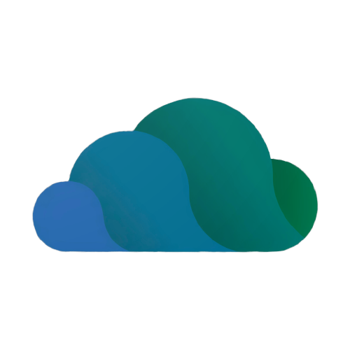
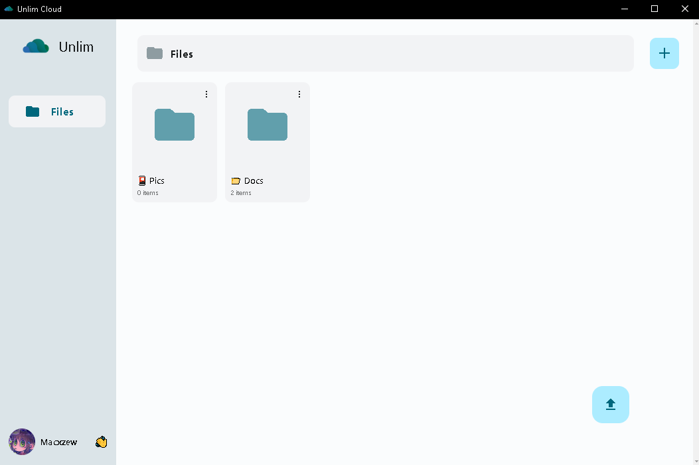

<p align="center">
    
</p>

<h1 align="center">
    <strong>UnlimDesk</strong>
</h1>

---

<p align="center">
    ☁️ Unlim Cloud desktop client powered by Telegram storage.
</p>

<p align="center">
    <a href="https://github.com/Nullmess/UnlimDesk/stargazers">
        
    </a>
    <a href="https://github.com/nullmess/UnlimDesk/releases/latest">
        
    </a>
    <a href="LICENSE">
        
    </a>
    
</p>

<p align="center">
    
</p>

---

## ✨ Features

- Desktop interface for Unlim Cloud
- Native application experience powered by Electron
- Dedicated window independent from the browser
- Windows, Linux and macOS builds
- Integrated session logout
- Upload activity indicator
- Simplified Unlim Cloud interface for desktop use
- External links automatically opened in the system browser
- Lightweight open-source desktop wrapper

---

## 🚀 Usage

To use this project, follow the steps below from the project directory.

### 1️⃣ Install dependencies

Install the required dependencies:

```shell
npm install
```

Run UnlimDesk:

```shell
npm start
```

Development mode:

```shell
npm run dev
```

Run the desktop application:

```shell
npm run app
```

### 2️⃣ Build the application

#### Windows

```shell
npm run build-win
```

The generated application is written to: `UnlimDesk-win32-x64/`

#### Linux

```shell
npm run build-lin
```

The generated application is written to: `UnlimDesk-linux-x64/`

#### macOS

```shell
npm run build-mac
```

The generated application is written to: `UnlimDesk-darwin-x64/`

#### All platforms

```shell
npm run build-all
```

---

## ⚖️ Disclaimer

UnlimDesk is an unofficial open-source desktop client for [Unlim Cloud](https://unlim-cloud.web.app/), originally created by [inulute](https://github.com/inulute). This project is independent and is not affiliated with or endorsed by the original Unlim Cloud project.

---

## 👤 Author

Give a ⭐️ if UnlimDesk helped you!

---

## 📄 License

Copyright © 2025-2026 [Nullmess](https://github.com/Nullmess).<br /> This project is licensed under the [MIT License](LICENSE).
